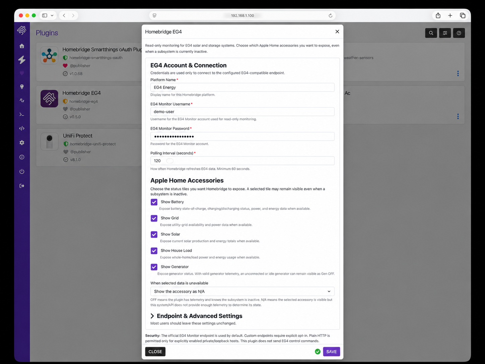
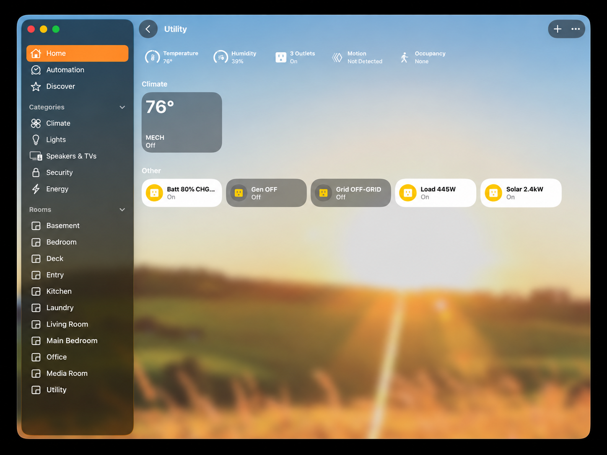
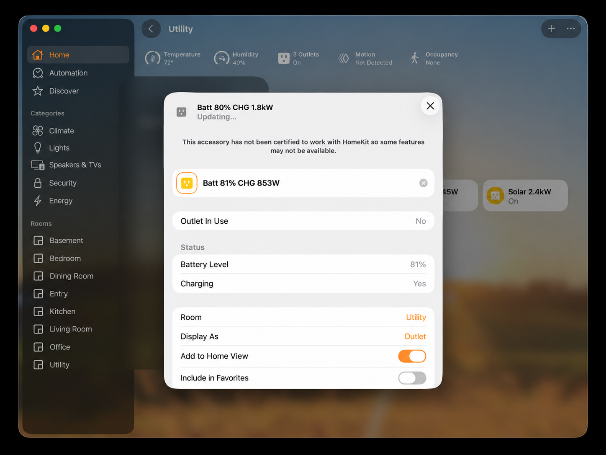

# homebridge-eg4 documentation

This folder contains public screenshots and supporting documentation for the homebridge-eg4 project.

## User interface screenshots

### Homebridge settings

The plugin configuration is divided into three areas:

- **EG4 Account & Connection** — account credentials and polling interval
- **Apple Home Accessories** — individual visibility controls for Battery, Grid, Solar, House Load, and Generator
- **Endpoint & Advanced Settings** — custom endpoint and diagnostic options

### Apple Home status tiles

The plugin exposes separate quick-glance accessories for Battery, Generator, Grid, House Load, and Solar.

The tile labels are dynamic and are intended to show useful state at a glance, for example:

- `Batt 80% CHG...`
- `Gen OFF`
- `Grid OFF-GRID`
- `Load 445W`
- `Solar 2.4kW`

### Battery details

Battery details use native HomeKit battery characteristics where possible, including Battery Level and Charging state. Apple Home decides which additional HomeKit characteristics it renders.

## Screenshot notes

The screenshots in this folder are sanitized documentation images. Usernames, host addresses, room names, and other environment-specific details may be replaced with generic examples.

The screenshots illustrate typical behavior and are not intended to guarantee identical rendering on every Apple Home or Homebridge version.
